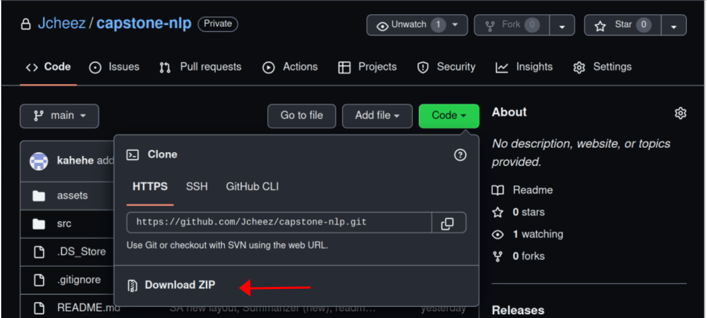
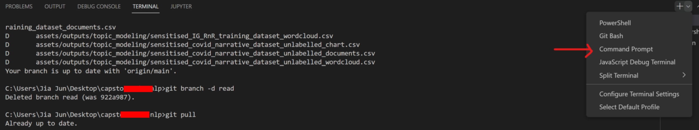

## Installation Guide

### Windows Installation
1. Install Visual Studio C++ build tools
https://stackoverflow.com/questions/64261546/how-to-solve-error-microsoft-visual-c-14-0-or-greater-is-required-when-inst

2. Install [python](https://www.python.org/downloads/)

3. Download [visual studio Code](https://code.visualstudio.com/download)

4. Download the project by clicking Code -> Download Zip. Unzip the project and place the unzipped folder in the desktop.

5. Open up Visual Studio Code. Click on File -> Open Folder. Open up the project from the desktop

6. In visual studio code, click Terminal -> New Terminal. Click on the terminal type: Command Prompt

7. Change the python interpreter in Visual Studio Code
 
Click the interpreter that corresponds to the virtual environment 

8. Type the following code in the terminal: `pip install virtualenv`

9. Create a new virtual environment using the following code: `virtualenv venv`

10. Start virtual environment (venv) using: `venv\Scripts\activate`

11. Install requirements: `pip install -r requirements.txt`

12. Type the following code: `python main.py`

13. To deactivate the virtual environment: `venv\Scripts\deactivate`

### Mac Installation

1. Download [vusual studio Code](https://code.visualstudio.com/download)

2. Download the project by clicking Code -> Download Zip. Unzip the project and place the unzipped folder in the desktop.

3. Open up Visual Studio Code. Click on File -> Open Folder. Open up the project from the desktop

4. Change the python interpreter in Visual Studio Code
 
Click the interpreter that corresponds to the virtual environment 

5. Type the following code in the terminal: `pip install virtualenv`

6. Create a new virtual environment using the following code: `virtualenv venv`

7. Start virtual environment (venv) using: `source venv/bin/activate`

8. Install requirements: `pip install -r requirements.txt`

9. Type the following code: `python main.py`

10. To deactivate the virtual environment: `source venv/bin/deactivate`